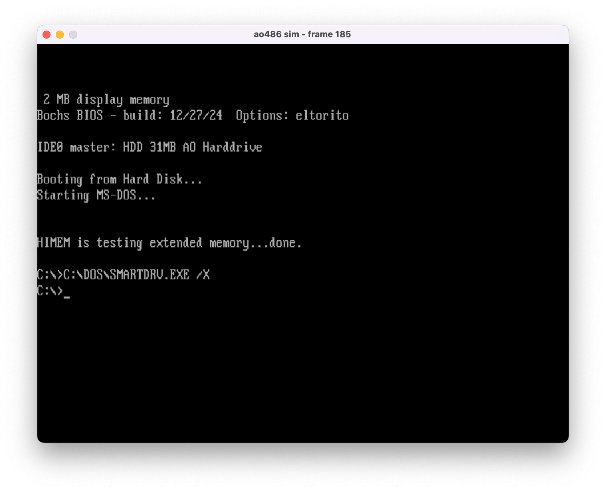
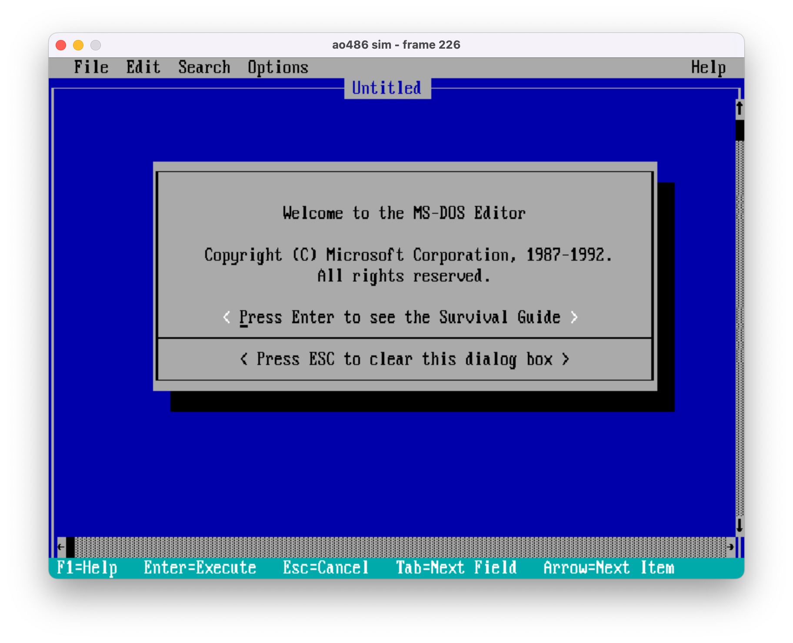
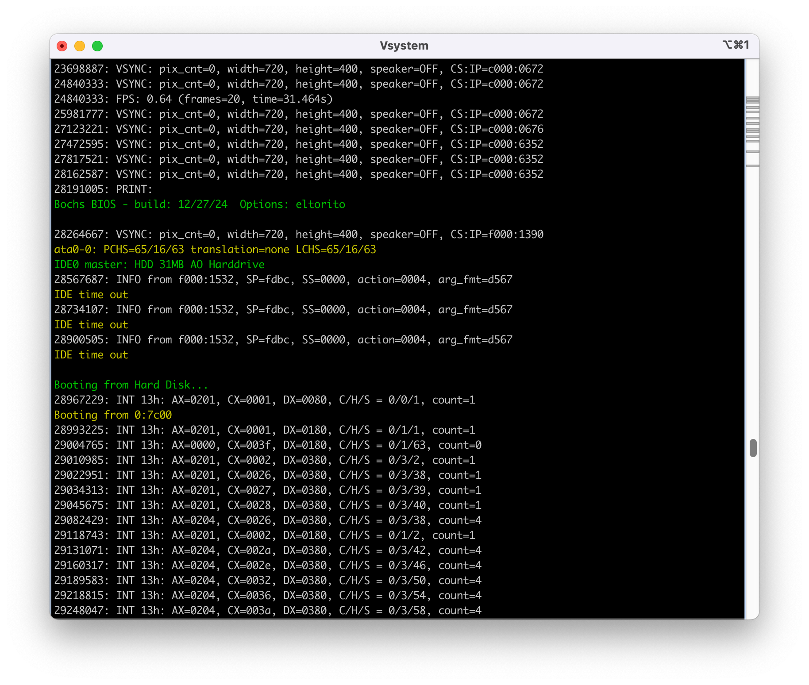

# ao486-sim: Intel 80486 CPU and PC Architecture Simulator

A complete whole-system simulation of the ao486 CPU core and PC architecture, hacked together for learning and understanding the inner workings of Intel 80486 processors and classic PC hardware. This simulator includes a fully functional MS-DOS 6.22 system with working hard disk support.

## Overview

ao486-sim is an educational tool that simulates:
- **Intel 80486-compatible CPU core** with full x86 instruction set support
- **Complete PC architecture** including essential peripherals
- **Working MS-DOS 6.22** system 
- **Real-time VGA graphics** for text and graphics
- **PS/2 keyboard** support in simulation
- **IDE/ATA hard disk controller** with virtual disk support (raw format)
- **Bochs BIOS**: Full PC BIOS implementation

## Quick Start

### Prerequisites
- **Verilator** (5.0 or later)
- **SDL2** development libraries
- **C++17** compatible compiler
- **Make**

### Building and Running

```bash
git clone https://github.com/nand2mario/ao486-sim.git
cd ao486-sim/verilator
make sim
```

The simulator will start and boot into MS-DOS 6.22. You'll see the familiar DOS prompt after the boot sequence completes.

A few notes:
- **Keyboard**: You can type directly at the DOS prompt. The simulator converts your key presses into PS/2 scancodes and delivers them to the RTL core.
- When you see "Starting MS-DOS...", pressing any key will speed up the boot process, as DOS is waiting for user input at that stage.
- **Output**: Watch the terminal window for colored status messages from the BIOS and DOS. These are captured by intercepting specific software interrupts and function calls.
- **Exit**: To quit, simply close the window or press Ctrl+C in the terminal.
- **Hard disk**: The hard disk image is not automatically saved; you must manually persist any changes by pressing a key (CMD-s on Mac or WIN-s on Windows). The IDE module (`src/soc/ide.v`) is based on ao486's original `hdd.v`, which used an SD card for storage. In this simulator, it has been modified to use a disk image file instead.
- 2MB of main memory is available by default. You can increase this by modifying `init_cmos()` in `main.cpp` and `SIZE_MB` in `src/sdram_sim.sv`. Note that increasing memory will cause himem.sys initialization to take proportionally longer.
- On an M4 MacBook Pro, the simulation runs at about 0.7 FPS, and booting DOS takes roughly 1.5 minutes.
- There is a known [Verilator race condition](https://github.com/verilator/verilator/issues/5756) that can cause `Internal Error: ../V3TSP.cpp:353` during compilation. If you encounter this, try running `make` several times. If the issue persists, remove `--threads 2` from the Makefile; the simulation will run a bit slower, but should work reliably.

### Making new disk images

The dos6.vhd is just the raw sectors of the hard disk. The easies way I found to create and manipulate them is `qemu-img` as part of QEMU. To create a new image,

```bash
qemu-img create my.vhd 32m
```

Then you can mount the image and install DOS or other software packages from floppies,
```bash
qemu-system-i386 -drive file=my.vhd,format=raw,index=0,media=disk -m 64 -L . -fda msdos6_22disk1.img -boot a
```

Read `Makefile` for how to use the new hard disk image.

### About ao486
The [ao486](https://github.com/MiSTer-devel/ao486_MiSTer) CPU implements a 4-stage pipeline:
1. **Decode**: Instruction decoding and operand preparation
2. **Read**: Reads in required data from memory.
3. **Execute**: ALU operations, memory address calculation
4. **Write**: Memory and register write-backs.

## Screenshots

Booting DOS 

DOS edit.com 

Captured messages from Bochs BIOS 

## Debugging and Analysis

### Waveform Analysis

Generate detailed waveforms for analysis:
```bash
make trace
```

This creates a waveform file that can be viewed with GTKWave:
```bash
gtkwave waveform.fst
```

## Acknowledgments

- **ao486 project**: Original CPU implementation
- **Bochs project**: BIOS and PC architecture reference

---

*ao486-sim: Learn x86 architecture by running a complete PC system in simulation* 